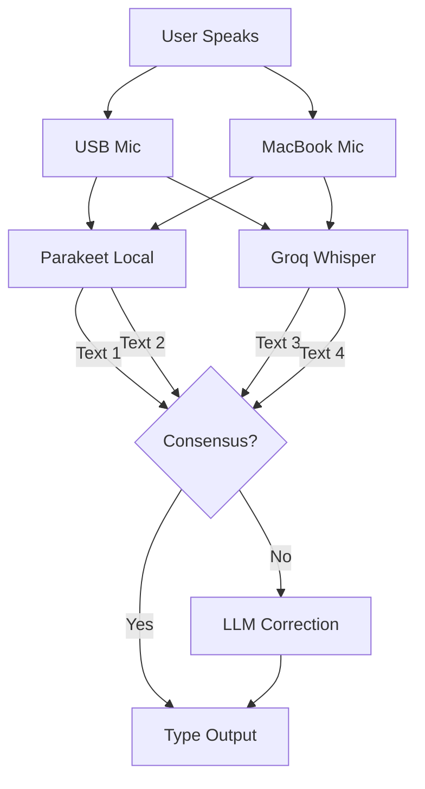

# MergeScribe 🎤

**MergeScribe** is a fast, accurate voice-to-text tool for macOS. It combines local AI with cloud intelligence and multi-microphone redundancy to deliver the best voice typing experience possible.


## 🚀 Key Features

### 1. Multi-Mic Redundancy 🎙️
Why rely on one microphone? MergeScribe listens to **all your microphones simultaneously**:
- USB condenser mic (high fidelity)
- MacBook built-in (room tone)
- AirPods (close talk)

All streams are processed in parallel using local AI (Parakeet) or Cloud AI (Groq), then consensus voting picks the best transcription. If one mic muffles a word, another catches it.

### 2. Pre-Roll Engine ⚡
No startup delay. Microphones stay "warm" in a ring buffer, so pressing the hotkey captures audio instantly—including the split-second *before* you pressed it.

### 3. Intelligent Fast Path 🏎️
- **Consensus Detection:** If multiple mics agree on a short phrase, skip the LLM entirely for instant output
- **Smart Routing:** Short queries use fast models, complex ones get routed to smarter models

### 4. Context Awareness 🧠
MergeScribe knows what you're doing:
- **App Detection:** VS Code biases towards code syntax, Slack prefers conversational style
- **History:** Remembers recent sentences for pronoun resolution

### 5. Text Editing Mode ✏️
Highlight any text, press the hotkey, and say "Change Parachute to Parakeet":
- Grabs the selected text
- Applies your voice command via LLM
- Replaces the text instantly

---

## 🛠️ Installation

1.  **Clone & Setup:**
    ```bash
    git clone https://github.com/kalpit-S/mergescribe.git
    cd mergescribe
    python3 -m venv venv
    source venv/bin/activate
    pip install -r requirements.txt
    ```

2.  **Install Parakeet (Apple Silicon):**
    ```bash
    pip install parakeet-mlx
    ```

3.  **Configure:**
    - Create a `.env` file with your keys:
        ```env
        GROQ_API_KEY=gsk_...
        OPENROUTER_API_KEY=sk-or-...
        ```
    - Or use the Settings menu in the app.

4.  **Run:**
    ```bash
    python -m mergescribe
    ```

---

## ⚙️ Configuration

Open **Settings** via the 🎙️ icon in the menu bar.

*   **General:** Set your Trigger Key (default: Right Option)
*   **Audio:** Select all microphones you want to use
*   **Models:** Choose `parakeet` (local, free, fast) or `groq` (cloud, fast)

---

## 🏗️ Architecture



---

License: MIT
