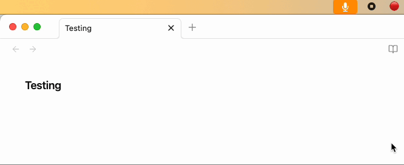
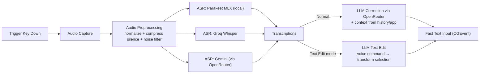
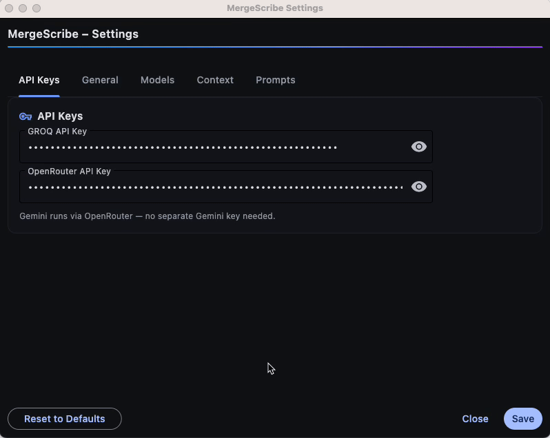
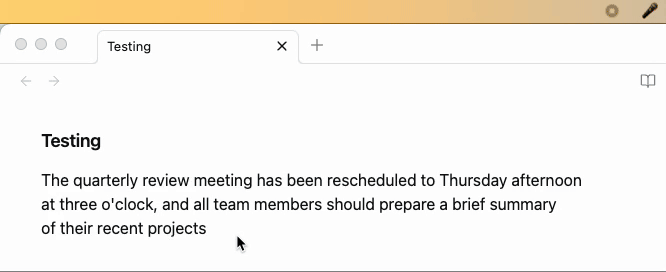

# MergeScribe

**Multi-provider transcription system with consensus orchestration**

Transform voice into text with AI-powered transcription that's faster, more accurate, and cheaper than commercial alternatives. 

[](https://www.python.org/)
[](https://opensource.org/licenses/MIT)
[](https://www.apple.com/macos/)

## Why I Built This

I think faster than I type. Voice is our highest bandwidth output, but every transcription tool I tried was either:
- Too slow
- Too inaccurate  
- Prone to just not returning anything
- Inability to customize the output

Built this to solve those problems. Hold a key, speak, release—text appears instantly at your cursor, properly formatted and context-aware. I've measured it at 200+ WPM. Great for docs, emails, messages, and LLM prompts.


<p align="center">
  
</p>
<p align="center"><em>Hold key → speak → instant text at cursor</em></p>


## Tech Stack

- **Core**: Python, NumPy, SciPy, SoundDevice/SoundFile
- **UI**: rumps (menu bar), Flet (settings), PyObjC Quartz (CGEvent)
- **ML/AI**: Parakeet MLX (local), Groq Whisper, Gemini (via OpenRouter), OpenRouter LLMs
- **Audio**: ffmpeg, custom DSP pipeline

## System Architecture



## Technical Implementation

### Provider Orchestration
- **Parallel execution**: Providers run concurrently in a thread pool; timeout ≈ recording length in seconds (min 3s, max 120s)
- **LLM consolidation**: When multiple providers return different transcripts, an LLM intelligently merges them to produce the most accurate result, taking into account the context of previous transcriptions and the current application
- **Failure isolation**: As long as one provider works, the system works
- **Turbo mode**: First-to-finish option trades accuracy for speed, using the first provider result without correction (often < 150ms latency)

### State Management & Reliability
- **Thread-safe recording state**: Global state protected by locks, preventing race conditions during rapid start/stop
- **Resource cleanup**: Explicit thread cancellation and audio stream termination on early completion
- **Graceful degradation**: System remains functional with any subset of providers available

### Production Engineering
- **Configuration precedence**: Environment variables → settings.json → defaults, with live reload
- **Dynamic settings**: Some settings (e.g., trigger key) refresh immediately; others apply on save
- **Comprehensive error handling**: Up to 3 attempts with 1s delay; provider-specific errors logged
- **Observability**: Detailed timing breakdowns per stage, per-provider timings, and WPM (speech vs end-to-end)

## Key Features

- **Lightning-Fast Transcription**: Hold Right Option, speak, release—text appears instantly
- **Smart Text Editing**: Select text, hold key, speak command—AI transforms selection in place
- **Multiple AI Providers**: Local (Parakeet MLX), Groq Whisper, Gemini, with automatic fallback
- **Turbo Mode**: Use first provider result for minimal latency
- **Privacy Mode**: Fully offline operation with Parakeet MLX
- **Context Awareness**: Adapts transcription style based on active application

<p align="center">
  
</p>
<p align="center"><em>Customize providers, prompts, and behavior</em></p>

## Text Editing Magic

Select any text, anywhere—in your browser, email, IDE—hold the trigger key and speak a command. The selected text is instantly replaced with the transformed version. Examples:
You can speak any edit instruction you want—rewrite, translate, format, summarize, change tone, expand/condense, and more.
- "Make this more professional" → rewrites casual text
- "Translate to Spanish" → instant translation
- "Convert to bullet points" → reformats as a list
- "Fix the grammar" → corrects errors in place
- "Make this a proper docstring" → formats code documentation

No copy-paste. No app switching. Just select, speak, done.

<p align="center">
  
</p>
<p align="center"><em>Select text → speak a command (e.g., translate, rewrite, format) → instant transformation</em></p>

## Smart Context Adaptation

The correction step automatically includes the active app/window title and a short history of recent transcriptions to improve relevance. App‑specific behavior (e.g., more formal in Gmail, casual in Slack) requires adding rules to your prompts.

### How to configure
- Open Settings → Prompts → System Context
- Add conditional rules like: “If the active application contains 'Gmail', …; if it contains 'Slack', …”
- Keep rules concise; the app/window string looks like “AppName | Window Title”

### Example rules you can add to your prompt
- Gmail: Prefer a professional tone; expand contractions; keep salutations concise
- Slack: Keep a casual tone; preserve emoji shortcodes like :thumbsup:
- Terminal: Preserve exact command syntax; do not add punctuation that would change commands

## Performance at a Glance

Typical end-to-end latency on Apple Silicon (short dictations):

| Mode                                    | Typical latency | Use when                                   |
|-----------------------------------------|-----------------|--------------------------------------------|
| Turbo (first result, no correction)     | < 200 ms        | Speed matters most                         |
| Full pipeline (multi-provider + good LLM)    | ~ 1 s           | Best accuracy/clarity with correction      |

Notes:
- Actual time scales with recording length and network
- Turbo returns the first provider to finish; full pipeline compares providers and applies LLM correction
- Effective typing speed: 220+ WPM with turbo mode
- Append ":nitro" at the end of your openrouter model name to choose the fastest provider

## Cost Analysis

- **Local only**: $0/month (Parakeet MLX)
- **Hybrid setup**: ~$1/month typical usage
- **Commercial alternatives**: $8-15/month

## Quick Start

### Prerequisites
- macOS (Apple Silicon required for local transcription)
- ffmpeg: `brew install ffmpeg` (required by Parakeet MLX)

### Installation
```bash
git clone https://github.com/kalpit-S/mergescribe
cd mergescribe
python -m venv venv
source venv/bin/activate
pip install -r requirements.txt
```

### Configuration
Set API keys via environment or GUI (optional—works without keys using local model):
```bash
GROQ_API_KEY=your_groq_key        # For Groq Whisper
OPENROUTER_API_KEY=your_or_key    # For LLM correction & Gemini
```

### Launch
```bash
python main.py
```

Look for the 🎤 icon in your menu bar.

### macOS Permissions Required
- **Microphone**: System Settings → Privacy & Security → Microphone
- **Accessibility**: System Settings → Privacy & Security → Accessibility (for typing via CGEvent and clipboard access)
- **Input Monitoring**: System Settings → Privacy & Security → Input Monitoring

### If typing suddenly stops working (common after macOS/Warp updates)
- Re-check **Accessibility** + **Input Monitoring** for the app that launches MergeScribe (Terminal, Warp, Cursor, etc.) and for your Python runtime if it appears separately.
- Some apps temporarily enable **Secure Input / secure text entry** (password prompts, key managers, etc.), which can block synthetic key events. If MergeScribe is still transcribing but nothing is inserted, use the **Auto-copy final result to clipboard** setting and paste.

## Usage

### Transcription Modes
**Press-and-hold**: Hold Right Option (⌥), speak, release  
**Toggle mode**: Double-tap Right Option (⌥) → speak freely → tap once to stop and transcribe

### Text Editing
**Text Editing**: Select text → hold trigger → speak command → automatic replacement

## Project Structure
```
mergescribe/
├── main.py                 # Menu bar application
├── transcriber.py          # Core transcription orchestration
├── text_editing.py         # Smart text transformation logic
├── audio_processing.py     # DSP pipeline
├── fast_text_input.py      # CGEvent text injection
├── config_manager.py       # Settings management
└── providers/              # AI provider implementations
    ├── parakeet_mlx.py    
    ├── groq_whisper.py    
    └── gemini.py          
```

## Extending

### Adding Providers
1. Implement `transcribe_sync(audio_bytes)` in `providers/`
2. Add to `ENABLED_PROVIDERS` in settings
3. Provider automatically integrated into consensus system

### Custom Prompts
Modify transcription behavior via Settings → Prompts. The correction step automatically includes recent transcriptions and the current app/window title as context so output adapts to what you're doing.

## Testing
Tests covering audio DSP, providers, configuration, and core utilities.
```bash
python verify_installation.py  # Check dependencies
python run_tests.py           # Run test suite
```

## Future Roadmap

- Cross-platform support (Windows)
- Custom vocabulary for technical terms
- Voice commands for system control (e.g., "search for ___" → Ctrl+F)
- Dynamic correction detection (skip LLM when unnecessary)
- Predictive text completion based on context

## License

MIT License

## Acknowledgments

- Fast text input approach inspired by [edward-io's CGEvent implementation](https://github.com/senstella/parakeet-mlx/issues/20)
- Local transcription powered by [Parakeet MLX](https://github.com/senstella/parakeet-mlx)
