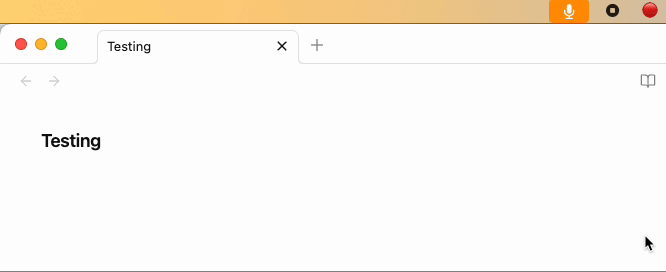
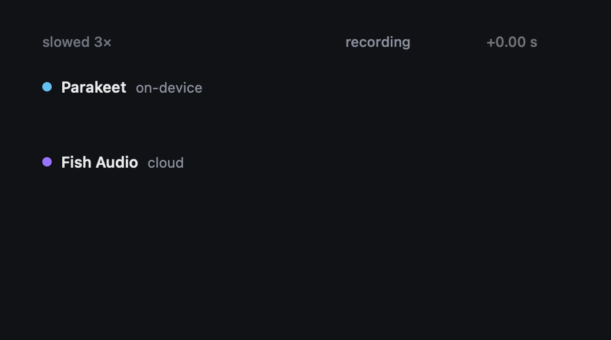
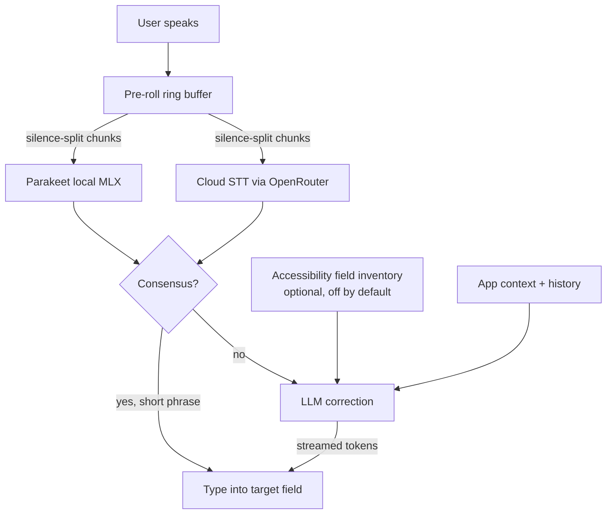

# MergeScribe 🎤

Local-first voice-to-text for macOS. Hold a hotkey, talk, release, and clean text is
typed wherever you're working.



Parakeet (0.6B, on-device via MLX) transcribes in ~300ms. Cloud recognizers can run in
parallel on the same audio, and a fast LLM merges their transcripts into what you
actually said before typing it.



*A real dictation from the metrics log, replayed by `scripts/render_merge_demo.py`.
Parakeet heard "the new series", Fish Audio heard "Does is", and the correction model
kept what each got right. Slowed 3×; the times shown are the logged ones.*

---

## 🏗️ How it works


```mermaid
graph TD
    User[User speaks] --> Ring[Pre-roll ring buffer]
    Ring -->|silence-split chunks| Parakeet[Parakeet local MLX]
    Ring -->|silence-split chunks| Cloud[Cloud STT via OpenRouter]

    Parakeet --> Consensus{Consensus?}
    Cloud --> Consensus

    Consensus -->|yes, short phrase| Typer[Type into target field]
    Consensus -->|no| LLM[LLM correction]

    AX[Accessibility field inventory<br/>optional, off by default] --> LLM
    Context[App context + history] --> LLM

    LLM -->|streamed tokens| Typer
```

The UI thread never blocks: audio callbacks only fill buffers, and STT, correction and
typing all happen on session threads. ~8k lines of Python, 214 tests.

---

## 🚀 Features

**Pre-roll.** Microphones stay warm in a ring buffer, so pressing the hotkey captures
audio instantly — including the split second *before* you pressed it.

**Live chunking.** Long dictations are split on silence and transcribed while you're
still talking, so releasing the key only waits on the final chunk.

**Consensus counts providers, not mics.** One model agreeing with itself across two
microphones rules out acoustic noise but not its own systematic errors. When two
*different* providers agree on a short, filler-free phrase, correction is skipped
entirely for instant output.

**Provider deadline.** A chunk is only as fast as its slowest recognizer. Once the
fastest answers, the rest get a proportional grace period and are then left behind —
tunable via `provider_deadline_multiplier` and `provider_deadline_min_ms`, or set the
multiplier to 0 to always wait for everyone.

**LLM correction.** Filler words go, self-corrections resolve ("Tuesday, no wait,
Friday" → "Friday"), punctuation is fixed, and the result streams into your app token
by token. If the model is unreachable the raw transcript is typed instead, so a
dictation is never lost.

**Learns your vocabulary.** After typing, MergeScribe watches the destination field and
records what you changed, filtering out sends, clears, app reformatting and
mid-keystroke snapshots. A correction you make in two separate dictations becomes
evidence in the prompt — what the recognizers wrote, what you changed it to, how often —
so a name you keep fixing gets spelled right without every similar-sounding word being
rewritten. The corpus stays on your machine.

**Recording HUD.** A borderless panel shows the pipeline as it runs: one strand of light
per stream (a recognizer on a mic), moving with your voice and flashing when that
recognizer returns a chunk. After you let go, each strand falls into a single line as
its result lands, one left behind by the deadline fades out, and a pulse runs along the
line and through your words while the correction model works. All damped springs, ~2ms
of main-thread time per frame. It's a non-activating `NSPanel`, so it never steals focus
from the field you're dictating into. `scripts/preview_hud.py` plays a scripted
dictation through it.

**Text editing mode.** Select any text, press the hotkey, and say "make this more
formal" — the selection is rewritten in place.

**Context awareness.** The active app and window title go into the correction prompt
(casual for chat apps, strict for documents), and recent dictations give it context for
resolving pronouns.

**Output routing** *(experimental, off by default)*. The Accessibility API enumerates
text fields across your open apps and the model picks where the dictation belongs. It
ships disabled: across 628 logged decisions it kept the focused field 88% of the time,
and the 12% that retargeted were wrong often enough that undoing them cost more than the
saved click.

---

## 🛠️ Install

Apple Silicon Mac required for local STT.

```bash
git clone https://github.com/kalpit-S/mergescribe.git
cd mergescribe
python3 -m venv venv && source venv/bin/activate
pip install -r requirements.txt
python -m mergescribe
```

**API key** (optional — without one, transcription runs fully offline and local): put
your OpenRouter key in `~/.mergescribe/.env` as `OPENROUTER_API_KEY=sk-or-...`, or enter
it in Settings after launching. It powers cloud STT and LLM correction.

**Permissions** (System Settings → Privacy & Security):

| Permission | Needed for |
|------------|-----------|
| Microphone | Recording |
| Accessibility | Capturing your edits, field routing (grant to your terminal if running from source) |
| Input Monitoring | Hotkey detection and typing output (macOS prompts on first run) |

---

## ⚙️ Settings

Open **Settings** from the 🎙️ menu bar icon — a native AppKit window with a sidebar,
opened in-process, so there is no second runtime to start.

- **Setup** — microphones, trigger key (default: Right Option, hold to record or
  double-tap to toggle), silence and chunking tuning, HUD toggle
- **API Keys** — OpenRouter key, correction model, reasoning effort
- **Instructions** — per-app rules, e.g. "When in Twitter, use lowercase"
- **Advanced** — full system-prompt override

Settings live in `~/.mergescribe/settings.json`. Metrics and opt-in training recordings
stay local in `~/.mergescribe/`.

---

## 🎓 Fine-tuning your own model

MergeScribe collects everything a personal STT fine-tune needs, and keeps all of it on
your machine:

| What | Where | Enabled by |
|------|-------|-----------|
| Audio + full session metadata | `~/.mergescribe/training/<date>/<session>/` | `training_enabled` (opt-in, off) |
| Your edits to the typed output | `~/.mergescribe/corrections.jsonl` | `edit_feedback_enabled` (on) |
| Per-provider transcripts, latencies, consensus | `~/.mergescribe/metrics.jsonl` | always |

Each sample pairs the raw audio with every provider's transcript and the final corrected
text, giving aligned (audio → what you actually meant) pairs rather than just recordings.

**Status:** collection is implemented and running; the fine-tuning script is not in this
repo yet. If you train on this data, filter out sessions whose chunks were silence —
earlier builds emitted dead air to the providers, and STT models hallucinate confidently
on silence, so those samples would teach the model to do the same.

---

## 🗺️ Roadmap

- **Ship the fine-tune pipeline** — turn the collected corpus into a LoRA on Parakeet.
- **Smarter routing** — richer context signals for choosing the output target.

License: MIT
