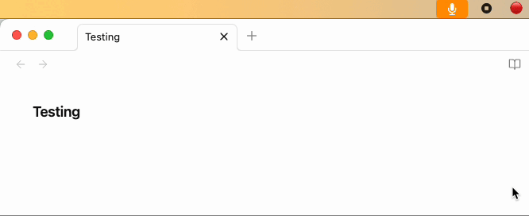
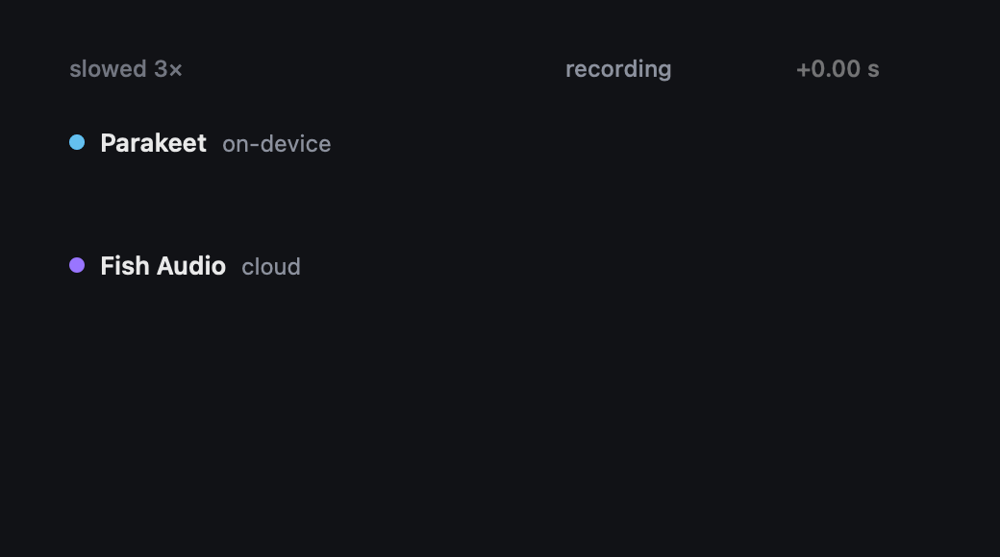
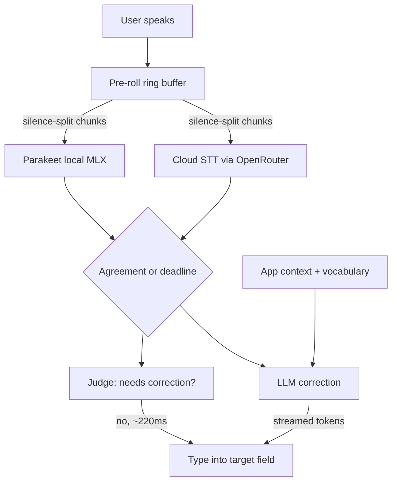

# MergeScribe 🎤

Local-first voice-to-text for macOS. Hold a hotkey, talk, release, and clean text is
typed wherever you're working.



Parakeet (0.6B, on-device via MLX) transcribes in ~300ms. Cloud recognizers can run in
parallel on the same audio, and a fast LLM merges their transcripts into what you
actually said before typing it.



*A real dictation from the metrics log, replayed by `scripts/render_merge_demo.py`.
Parakeet heard "the new series", Fish Audio heard "Does is", and the correction model
kept what each got right. Slowed 3×; the times shown are the logged ones.*

---

## 🏗️ How it works


```mermaid
graph TD
    User[User speaks] --> Ring[Pre-roll ring buffer]
    Ring -->|silence-split chunks| Parakeet[Parakeet local MLX]
    Ring -->|silence-split chunks| Cloud[Cloud STT via OpenRouter]

    Parakeet --> Wait{Agreement or deadline}
    Cloud --> Wait

    Wait --> LLM[LLM correction]
    Wait --> Judge[Judge: needs correction?]
    Judge -->|no, ~220ms| Typer[Type into target field]

    Context[App context + vocabulary] --> LLM

    LLM -->|streamed tokens| Typer
```

The UI thread never blocks: audio callbacks only fill buffers, and STT, correction and
typing all happen on session threads. ~8.8k lines of Python, 336 tests.

---

## 🚀 Features

**Pre-roll.** Microphones stay warm in a ring buffer, so pressing the hotkey captures
audio instantly — including the split second *before* you pressed it.

**Live chunking.** Long dictations are split on silence and transcribed while you're
still talking, so releasing the key only waits on the final chunk. A chunk that runs
past 30s waits for the next gap between words before cutting, rather than splitting a
word in half: forced cuts were 35% of all chunks, and 18% of the correction model's
edits were landing within two words of a seam, repairing damage the chunker caused.

**Consensus counts providers, not mics.** One model agreeing with itself across two
microphones rules out acoustic noise but not its own systematic errors. When enough
*different* providers agree, a chunk stops waiting on slower ones. Agreement settles
what was said, not whether it needs tidying ("um, ship it" can be agreed on too), so
the text still goes through the judge and the correction model.

**Skips correction when it isn't needed.** About a quarter of dictations come back already
saying exactly what you meant, and waiting on a correction model to hand them back
unchanged is pure latency. A classifier (TypeSafe's Jev) is asked, in one call and at the
same moment the correction request goes out, which transcript is most likely what was said
(or none of them), and the correction step's own jobs about each one: is there filler, a
restart, a likely mishearing, a punctuation or grammar fix to make. A transcript is typed as
it stands only when none applies. It answers in ~220ms, so a clean verdict types before the
correction's first token; anything else costs nothing, because the correction was already in
flight. On 600 logged dictations it skipped correction on 3.2%, with 3 of those skips typing
a word the correction would have changed, against 14 for the first design that asked about
"the best entry" instead of each transcript. Anything you've asked for beyond those jobs (your
Instructions, or your own correction prompt if you replaced the default) is one more question,
asked with the window you're typing into, so a rule like "all lowercase in Slack" still holds
when correction is skipped. `scripts/judge_eval.py` re-runs the measurement.
Off by default (`judge_enabled`).

**Provider deadline.** A chunk is only as fast as its slowest recognizer. Once the
fastest answers, the rest get a proportional grace period and are then left behind —
tunable via `provider_deadline_multiplier` and `provider_deadline_min_ms`, or set the
multiplier to 0 to always wait for everyone.

**LLM correction.** Filler words go, self-corrections resolve ("Tuesday, no wait,
Friday" → "Friday"), punctuation is fixed, and the result streams into your app token
by token. If the model is unreachable the raw transcript is typed instead, so a
dictation is never lost.

**Learns your vocabulary.** After typing, MergeScribe watches the destination field and
records what you changed, filtering out sends, clears, app reformatting and
mid-keystroke snapshots. A correction you make in two separate dictations becomes
evidence in the prompt — what the recognizers wrote, what you changed it to, how often —
so a name you keep fixing gets spelled right without every similar-sounding word being
rewritten. The same terms prime recognizers that accept them (AssemblyAI's key terms), and
anything that knows your words before you say them can add to `~/.mergescribe/vocabulary.txt`,
one term per line. The corpus stays on your machine.

**Recording HUD.** A small ink-black capsule shows the pipeline as it runs, opening out of
a dot when you press the key. Inside, each stream (a recognizer on a mic) is a curtain of
aurora: its rays climb higher the louder you speak, and it flares when that recognizer
returns a chunk. After you let go the curtains settle, one by one as their results land,
into a single glowing hem, and every word the correction model types sends light running
along it and on through the words — so a stalled stream looks stalled. A thin light runs
round the edge while the work happens. A dictation typed without correction flashes once;
one you call off draws itself in to a point. ~1.6ms of main-thread time per frame: the
aurora is computed with numpy at 1x over its strip alone, and its glow is a copy blurred
by Core Image on the GPU. It never takes focus from the field you're dictating into.


*Rendered from the app's own drawing code over a macOS wallpaper. `scripts/preview_hud.py`
plays the same dictation through the real panel.*

**Text editing mode.** Select any text, press the hotkey, and say "make this more
formal" — the selection is rewritten in place.

**Context awareness.** The active app and window title go into the correction prompt
(casual for chat apps, strict for documents), and recent dictations give it context for
resolving pronouns.

---

## 🧪 Tried and removed

**Output routing.** MergeScribe used to walk the Accessibility trees of open apps, hand
the model an inventory of text fields, and let it pick where a dictation belonged. Across
628 logged decisions it kept the focused field 88% of the time, and the 12% that moved
were wrong often enough that undoing them cost more than the saved click. Most people
dictate into the field they're looking at, so it was ~900 lines serving the rare case
badly. It's gone.

**Regex filler removal.** "um" and "uh" are the only filler words safe to delete
blindly, and they're 2% of what the correction model actually removes. The most-deleted
word is "like" — 6× more often than "um" — and it's exactly the one that can't go
without judgment: "it's like a queue" needs it.

---

## 🛠️ Install

Apple Silicon Mac required for local STT.

```bash
git clone https://github.com/kalpit-S/mergescribe.git
cd mergescribe
python3 -m venv venv && source venv/bin/activate
pip install -r requirements.txt
python -m mergescribe
```

**API key** (optional — without one, transcription runs fully offline and local): put
your OpenRouter key in `~/.mergescribe/.env` as `OPENROUTER_API_KEY=sk-or-...`, or enter
it in Settings after launching. It powers cloud STT and LLM correction.

**Permissions** (System Settings → Privacy & Security):

| Permission | Needed for |
|------------|-----------|
| Microphone | Recording |
| Accessibility | Capturing your edits to typed text (grant to your terminal if running from source) |
| Input Monitoring | Hotkey detection and typing output (macOS prompts on first run) |

---

## ⚙️ Settings

Open **Settings** from the 🎙️ menu bar icon — a native AppKit window with a sidebar,
opened in-process, so there is no second runtime to start.

- **Setup** — microphones, trigger key (default: Right Option, hold to record or
  double-tap to toggle), silence and chunking tuning, HUD toggle
- **API Keys** — OpenRouter key, correction model, reasoning effort
- **Instructions** — per-app rules, e.g. "When in Twitter, use lowercase"
- **Advanced** — full system-prompt override

Settings live in `~/.mergescribe/settings.json`. Metrics and opt-in training recordings
stay local in `~/.mergescribe/`.

---

## 🎓 Fine-tuning your own model

MergeScribe collects everything a personal STT fine-tune needs, and keeps all of it on
your machine:

| What | Where | Enabled by |
|------|-------|-----------|
| Audio + full session metadata | `~/.mergescribe/training/<date>/<session>/` | `training_enabled` (opt-in, off) |
| Your edits to the typed output | `~/.mergescribe/corrections.jsonl` | `edit_feedback_enabled` (on) |
| Per-provider transcripts, latencies, consensus | `~/.mergescribe/metrics.jsonl` | always |

Each sample pairs the raw audio with every provider's transcript and the final corrected
text, giving aligned (audio → what you actually meant) pairs rather than just recordings.

**Status:** collection is implemented and running; the fine-tuning script is not in this
repo yet. If you train on this data, filter out sessions whose chunks were silence —
earlier builds emitted dead air to the providers, and STT models hallucinate confidently
on silence, so those samples would teach the model to do the same.

---

## 🗺️ Roadmap

- **Ship the fine-tune pipeline** — turn the collected corpus into a LoRA on Parakeet.

License: MIT
